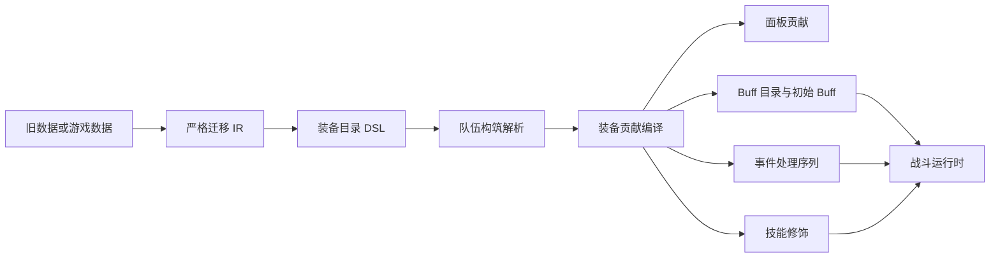

# Endaxis Next 武器、装备与套装 DSL 设计

本文研究 Endaxis Next 如何声明、解析和执行武器、装备与套装效果。结论基于当前 `src/next` 的干员定义、技能编译、Buff、事件、机制与运行时边界，以及旧版 `src/data/weapons`、`src/data/gears`、`src/data/gearsets` 和 `src/data/collect.ts` 的实际数据与执行入口。

本文同时记录设计边界与当前实现状态。`equipmentDefinition.ts` 已完成第一阶段 DSL 骨架，`compileEquipment.ts` 已能解析常驻修正和现有通用事件序列；完整 Build Resolver、面板安装、Buff 蓝图和尚未恢复的事件仍待实现。

## 结论摘要

武器、装备与套装不应直接进入战斗运行时，也不应复用干员天赋、潜能使用的 `UpgradeModifierDefinition`。推荐的数据流是：



核心原则如下：

1. 目录 DSL 保存等级化、纯数据、只读定义，不保存运行时 Buff 实例或回调。
2. 项目存档继续只保存武器、装备引用及用户选择的等级，不保存解析后的面板或战斗贡献。
3. 套装三件生效是统一构筑规则，不在每个套装定义里重复保存数量门槛。
4. 同一个静态修饰定义可以同时服务面板投影和战斗初始化，但只能有一个数值真相。
5. 事件触发效果编译为“事件过滤器 + 有序操作序列”，不沿用旧版松散的 `TriggerEffect` 运行时解释。
6. 武器形态是装备定义内部的构筑期选择，不是对干员技能的替换。
7. 未被 Next 事件或运行时原语覆盖的旧数据必须明确报错，不得静默丢弃或近似映射。

## 当前边界核对

### 干员定义与技能编译

`operatorDefinition.ts` 同时定义了等级值、构筑条件、技能、操作序列、战斗条件、事件处理器和干员养成修饰。`compileSkill.ts` 负责把技能等级数组解析为单等级的不可变程序，运行时不再读取养成状态。

其中 `UpgradeModifierDefinition` 的语义是“天赋或潜能修改干员自身定义”，例如启用技能分支、修改某一步伤害或改变技能消耗。装备来源不同、生命周期不同，也可能在换装时完全消失，因此不应把装备伪装成干员升级项。

### 属性与伤害修饰

`CombatAttributeSet` 已明确区分 `equipment`、`weapon`、`talent`、`potential`、`buff` 等来源，并按原生八槽公式聚合。这为静态装备属性和战斗期 Buff 共用属性公式提供了基础：

- 构筑解析得到的永久属性以 `equipment` 或 `weapon` 来源注册；
- 战斗中临时生效的属性由 Buff 以 `buff` 来源注册；
- 两者不能提前揉成一个无法追踪来源的最终数值。

伤害修饰则由 `DamageModifierDefinition` 描述作用方、处理阶段、倍率区间和条件。装备 DSL 不应直接构造有状态 `DamageModifier`，而应先生成纯数据修饰定义，再由 Buff 或战斗装配层持有实例。

### Buff 边界

`CombatBuffDefinition` 是运行时 Buff 目录定义，包含叠层、持续时间、黑板、属性修饰、伤害修饰、共享技力修饰和生命周期动作；`CombatBuff` 与 `CombatBuffContainer` 才持有一次模拟中的状态。

装备 DSL 可以声明“临时 Buff 蓝图”，由装备编译器转换成 `CombatBuffDefinition`。DSL 不应暴露 `CombatBuffDefinition.actions` 中的运行时回调，因为那会让数据文件绕过操作序列、事件顺序和可序列化约束。

### 事件边界

Next 当前的 `CombatEventTrigger` 只覆盖：

- 指定伤害标签命中；
- 元素附着施加；
- 指定技能命中；
- 语义状态到期；
- 语义状态被消耗。

旧装备实际还使用了开战、动作开始、技力回复、终结击、一般状态施加等事件。因此装备目录可以先保留经过严格枚举的声明，但只有被核心事件系统支持的事件才能编译为可执行贡献。不能为了迁移方便，把含义不同的旧事件硬映射到现有事件。

`AbilityEventDispatcher` 负责确定性分发，且拒绝同一事件下顺序未确认的同优先级动作。装备事件处理器进入该边界时也必须携带明确优先级；原生顺序未确认时应阻止编译，而不是依赖注册先后。

### 机制边界

`core/mechanics` 的模式值得复用：外部定义通过 Adapter 变成核心支持的纯数据贡献，且编译阶段校验顺序和数据纯度。但装备属于队伍构筑，不属于关卡或活动场景，不能直接伪装成 `MechanicContribution`。

推荐新增平行的装备贡献编译边界，共用 `ActionSequenceDefinition`、Buff、属性和事件原语，而不是共用机制的领域身份。

### 运行时装配

`CombatRuntimeAssembly` 只接收已编译技能、资源、Buff/状态容器和操作执行器，不读取项目文档或游戏目录。装备应在进入该装配层前完成：

- 武器、装备、套装引用和等级解析；
- 套装是否生效的判断；
- 形态选择；
- 面板与静态战斗修饰解析；
- Buff 定义注册；
- 开战序列和事件处理器编译。

运行时只消费这些产物，不再判断“穿了几件套装”或“武器第三词条多少级”。

## 旧版真实数据形状与入口

### 武器

旧 `WeaponSheet` 包含：

- `rarity`、`type`、`icon`；
- `baseAtk` 等级/突破节点数组；
- 三个独立技能槽，每槽包含 `effects` 与 `triggers`；
- 可选 `forms`，根据四维属性比较选择形态，并覆盖指定技能槽。

三个技能槽分别由 `skill1Level`、`skill2Level`、`skill3Level` 解析。武器基础攻击成长与词条等级不是同一条等级轴，不能统一塞进 `LevelValues` 后用同一个等级索引。

### 装备

旧 `GearPieceSheet` 包含：

- 名称、图标、槽位、等级需求；
- 固定防御力；
- 最多三个词条效果；
- 可选套装归属。

装备词条按对应精锻等级解析。旧收集器会把固定防御力临时合成为 `flatDef` 状态效果，这只是旧执行路径的实现手段，不应成为 Next DSL 的领域语义。

### 套装

旧 `GearSetSheet` 只有已解析的 `effects` 和可选 `triggers`。是否生效由 `collect.ts` 统一统计：同一套装装备数量达到三件后才收集其效果。

### 执行入口

旧版主要经过两条路径：

- `collectEffects` 收集干员、武器、装备和套装的常驻效果，再参与面板和战斗初始状态计算；
- `collectTriggerEffects` 收集事件触发效果，交给模拟器的 `TriggerRegistry` 分发。

武器形态通过 `computeWielderAttributes` 先计算不含形态覆盖的通用形态属性，再由 `resolveActiveWeaponForm` 选择，避免选择条件循环依赖自身结果。

这套实现证明了现有数据能工作，但也把面板、初始 Buff、事件、上下文属性和旧补丁系统混在同一 `Effect` 联合中。Next 不应原样搬运。

## 1. 可枚举的效果类别

### 当前武器、装备和套装中实际存在

| 类别           | 旧数据表达                             | 典型用途                                                 |
| -------------- | -------------------------------------- | -------------------------------------------------------- |
| 基础数值       | 武器 `baseAtk`、装备 `defense`         | 面板攻击、防御基础来源                                   |
| 永久属性修饰   | 无持续时间的 `status`                  | 四维、攻击、生命、防御、技艺强度、终结技充能效率、暴击等 |
| 永久范围修饰   | 无持续时间且带技能/元素过滤的 `status` | 元素伤害、技能伤害、失衡、冷却、技力回复等               |
| 临时状态修饰   | 带 `duration`、叠层或条件的 `status`   | 事件后短时增益、敌方易伤、减速等                         |
| 直接伤害       | `damageHit`                            | 事件触发的额外伤害和失衡                                 |
| 一次性效果     | `oneTime`                              | 为下一次符合条件的技能或伤害提供增益                     |
| 消耗效果       | `consume`                              | 主动结束或消耗指定状态                                   |
| 直接资源变化   | `spRecovery`                           | 套装触发后恢复共享技力                                   |
| 事件触发       | `triggers`                             | 命中、动作开始、状态施加/到期/消耗、技力回复、开战等     |
| 构筑形态       | 武器 `forms.selector`                  | 根据通用形态四维选择某个武器词条形态                     |
| 条件和生命周期 | `condition`、ICD、叠层、持续时间、目标 | 约束上述效果何时生效、如何刷新与消耗                     |

当前装备数据中的绝大多数条目是 `status`。少量武器或套装实际使用了 `damageHit`、`oneTime`、`consume` 和 `spRecovery`。装备单件当前只出现 `status`，但 DSL 不应据此把套装和武器强行拆成不同效果语言。

### 旧通用类型允许、但当前装备语料未实际使用

旧 `Effect` 还允许元素附着、元素爆发、元素反应、物理状态、持续伤害、技力返还、终结技能量、冷却立即缩减、派生效果和各类补丁。它们主要服务干员技能，不能仅因类型上可用就提前加入装备最小 DSL。

后续若游戏数据中真实出现，应基于原生行为和 Next 已有操作原语逐项扩展，并补真实样本测试。

## 2. 效果应进入哪个阶段

| 效果                                 | 面板计算             | 战斗启动                      | 事件触发                  | 技能替换/修饰                                          |
| ------------------------------------ | -------------------- | ----------------------------- | ------------------------- | ------------------------------------------------------ |
| 武器基础攻击、装备固定防御           | 是                   | 作为已解析战斗属性输入        | 否                        | 否                                                     |
| 四维、攻击、生命、防御等永久修饰     | 是                   | 注册静态属性来源              | 否                        | 否                                                     |
| 技艺强度、充能效率、暴击等永久修饰   | 是                   | 注册静态属性来源              | 否                        | 否                                                     |
| 永久元素/技能伤害与失衡修饰          | 面板支持该字段时投影 | 注册常驻伤害修饰              | 否                        | 通常不改技能定义                                       |
| 永久技力回复、消耗、冷却修饰         | 可投影               | 注册常驻资源/技能修饰         | 否                        | 只影响运行时规则，不重写动作序列                       |
| 有持续时间的增益或减益               | 否                   | 仅 `onBattleStart` 时可能施加 | 是                        | 否                                                     |
| `damageHit`、`spRecovery`、`consume` | 否                   | 仅开战事件可执行              | 是，以有序步骤执行        | 否                                                     |
| `oneTime`                            | 否                   | 仅开战事件可施加              | 是，编译成可消费临时 Buff | 不直接补丁技能                                         |
| 武器形态                             | 影响最终面板         | 决定采用哪组贡献              | 间接决定处理器            | 只选择武器槽定义，不替换干员技能                       |
| 真正改变技能分支、步骤或类型的装备   | 视具体效果           | 视具体效果                    | 视具体效果                | 需要独立、受限的技能编译修饰；当前装备语料尚无充分样本 |

### 一份静态定义，两个消费端

永久修饰既可能显示在面板，也必须影响战斗。推荐由一份 `StaticModifierDefinition` 作为唯一真相：

- 面板解析器根据修饰种类投影可见面板；
- 装备编译器将同一修饰转换为战斗属性或伤害修饰；
- 不分别在“面板效果”和“战斗 Buff”中抄写同一个数值。

这里的“静态”只表示构筑期可确定，不等于角色面板可见。全量严格适配审计见 `docs/research/equipment-static-candidate-coverage.md`：当前 901 条构筑期静态效果均可映射到现有 `EquipmentModifierDefinition`。其中 70 条未声明元素范围的 `dmgBonus` 已由旧版过滤测试与原生 DamageScale 注入链闭环：技能类型增伤独立于 DamageType，覆盖 `true` 与 `ether`，但 `lifeDrain` 最终值绕过 DamageScale，必须排除。完全无范围的“所有技能伤害”仍要显式限制为战技、连携技和终结技。

`ampBonus` 属于独立伤害增幅乘区，`attributeAtkPercent` 修改四维到攻击力的换算系数。即使未来出现无条件装备样本，它们也不能分别近似改写为 `damageBonus` 或 `attackPercent`，必须先扩展明确的 DSL 原语。

### 不应误判为技能替换的情况

- 按技能类型增加伤害、失衡、回复或减少冷却，是有过滤条件的运行时修饰，不需要改写技能步骤。
- `oneTime` 是等待消费的 Buff，不是提前修改下一项技能定义。
- 武器 `forms` 替换的是武器第三词条等装备贡献，不是干员的普通攻击或战技。
- 只有确实改变干员可释放技能、技能分支或动作序列的装备，才进入技能编译修饰边界；当前旧武器、装备和套装中没有足够证据要求开放通用补丁 DSL。

## 3. 建议的最小类型模型与编译边界

以下代码展示完整目标形状。当前实现已落地 `traits`、常驻修正和事件序列，Buff 蓝图、启动序列、技能修饰与武器形态仍属于后续扩展。

```ts
interface WeaponDefinition {
  readonly slug: string;
  readonly rarity: WeaponRarity;
  readonly weaponType: OperatorWeaponType;
  readonly baseAttackAtLevelNodes: readonly number[];
  readonly traits: readonly WeaponTraitDefinition[];
  readonly forms?: EquipmentFormDefinition;
}

interface GearDefinition {
  readonly slug: string;
  readonly slotType: GearSlotType;
  readonly levelRequirement: number;
  readonly baseDefense: number;
  readonly traits: readonly GearTraitDefinition[];
  readonly gearSetSlug?: string;
}

interface GearSetDefinition extends EquipmentContributionDefinition {
  readonly slug: string;
}

interface WeaponTraitDefinition extends EquipmentContributionDefinition {
  readonly key: string;
  readonly levelCount: number;
}

interface EquipmentContributionDefinition {
  readonly modifiers?: readonly EquipmentModifierDefinition[];
  readonly eventHandlers?: readonly EquipmentEventHandlerDefinition[];
  // 下列能力尚未实现，待真实样本和核心原语闭环后再加入：
  readonly buffDefinitions?: readonly EquipmentBuffDefinition[];
  readonly startup?: ActionSequenceDefinition;
  readonly skillModifiers?: readonly EquipmentSkillModifierDefinition[];
}
```

其中：

- `StaticModifierDefinition` 使用可辨识联合枚举四维、面板属性、伤害、资源和冷却修饰，保留技能类型、技能身份、伤害元素等明确过滤器；
- `EquipmentBuffDefinition` 是纯数据蓝图，编译后生成 `CombatBuffDefinition`，不能携带回调；
- `startup` 只表达开战立即执行的有序操作，例如施加常驻 Buff；
- `EquipmentEventHandlerDefinition` 由事件、条件、优先级和 `ActionSequenceDefinition` 组成；
- `EquipmentSkillModifierDefinition` 只为有真实装备样本、且不能由静态运行时修饰表达的技能结构变化开放枚举项。

建议不要在每个效果上增加 `destination: panel | runtime`。目的地应由效果种类的稳定语义决定，防止同一种修饰被不同配置作者路由到不同阶段。

### 构筑解析产物

项目配置与目录定义解析后，生成一次队伍构筑专属、不可变的产物：

```ts
interface ResolvedEquipmentLoadout {
  readonly sources: readonly ResolvedEquipmentSource[];
  readonly staticModifiers: readonly ResolvedStaticModifier[];
  readonly buffCatalog: readonly CombatBuffDefinition<string>[];
  readonly startupSequences: readonly ResolvedActionSequence[];
  readonly eventHandlers: readonly ResolvedEquipmentEventHandler[];
  readonly skillModifiers: readonly ResolvedEquipmentSkillModifier[];
}
```

它应完成等级展开、`main`/`sub` 属性解析、套装计数、形态选择、机械身份生成和引用校验。此后面板与战斗只读该产物，不再访问旧数据或项目对象。

### 编译阶段顺序

建议固定为：

1. 校验干员、武器、装备与套装引用；
2. 解析武器等级、目录声明的词条等级和装备精锻等级；
3. 收集不依赖武器形态的静态属性；
4. 计算通用形态四维；
5. 选择武器形态并合并对应技能槽覆盖；
6. 统计套装，三件及以上时加入套装 bundle；
7. 将所有等级化贡献解析为单值；
8. 生成稳定的静态修饰、Buff、开战序列和事件处理器身份；
9. 校验 Buff、事件、技能及状态引用；
10. 分别交给面板解析器、技能编译器和战斗装配器。

形态条件不得读取形态自身新增的属性，否则会重新引入旧版专门规避的循环依赖。

### 当前需要补齐的核心能力

在完整执行旧装备前，Next 至少还缺少：

- 一般状态施加事件，而不只是元素附着施加事件；
- 开战事件；
- 动作开始、终结击和技力回复事件；
- 与旧状态身份等价的稳定语义状态或 Buff 标签过滤；
- 装备静态修饰到 `CombatAttributeModifier`、`DamageModifierDefinition` 和资源/冷却修饰的编译器；
- 纯数据 Buff 蓝图到 `CombatBuffDefinition` 的编译边界；
- 装备事件优先级及同帧顺序的证据和校验。

这些缺口应由核心提供通用语义，不能在装备 Adapter 中用临时回调补齐。

## 4. 旧数据迁移与生成器中间层

不建议让旧 `WeaponSheet`、`GearPieceSheet` 和 `GearSetSheet` 直接实现 Next 契约。应增加只在 Adapter/生成器侧存在的严格 IR：

```text
旧 TypeScript 数据 / 游戏表
  -> SourceEquipmentIR
  -> 严格规范化与能力审计
  -> Next EquipmentDefinition
  -> 构筑解析与装备贡献编译
```

### `SourceEquipmentIR` 的职责

- 保留来源路径、旧槽位、效果下标和原始身份，便于错误定位；
- 明确区分武器等级轴、词条等级轴和装备精锻等级轴；
- 将旧 `status.stat` 拆成稳定的修饰类别、作用目标和过滤条件；
- 保留触发器、条件、持续时间、叠层、ICD 和施加顺序；
- 记录迁移是否完全闭环，以及具体不支持路径；
- 不进入项目存档，也不成为运行时对象。

### 严格迁移规则

Adapter 必须对效果种类、修饰种类、目标、事件、条件和等级数组做穷尽匹配。遇到以下情况立即失败：

- 未知 `kind` 或修饰类型；
- 无法对应的旧字符串状态身份；
- 等级数组长度与槽位等级范围不一致；
- 同一旧字段在 Next 中存在多个可能语义；
- 事件顺序或目标来源存在歧义；
- 旧数据包含函数、动态闭包或无法转为纯数据的字段。

错误至少包含 `source slug -> skill slot -> effect/trigger index -> field` 路径。不得取第一个候选、填零、忽略字段或把不支持效果降级为仅展示文本。

### 分层可用性

可将迁移结果分为三个独立能力层：

1. **目录身份可用**：可用于项目引用和选择器；
2. **构筑数值可用**：基础攻击、防御与静态面板贡献已完整解析；
3. **战斗行为可用**：全部事件、Buff 和操作均可编译执行。

某件武器即使事件部分尚未被 Next 支持，其目录和已闭环静态属性仍可用于研发验证；但正式模拟必须在选中来源存在未编译战斗贡献时明确拒绝或给出阻断诊断，不能悄悄少算。

### 旧入口需要的最小补充

旧 `src/data/index.ts` 已能枚举武器和装备，但套装目前只有按 slug 查询，没有稳定的全量列表。后续 Adapter 若复用旧数据，应由旧数据边界显式提供只读套装列表，而不是让 Next 核心扫描文件系统或复制一份套装注册表。

长期方案应由生成器直接产出符合 Next 契约的数据；旧 Adapter 只作为迁移期的对照与完整性审计工具，不成为永久运行路径。

## 5. 代表样本

### 武器：白夜新星

旧文件：`src/data/weapons/sword/6/white-night-nova.ts`。

它覆盖了适合作为第一批闭环样本的四类能力：

1. 武器基础攻击成长；
2. 第一词条按等级增加主属性；
3. 第二词条按等级增加技艺强度；
4. 第三词条永久增加四种法术伤害，并在敌人受到燃烧或电磁反应时，为自身施加 15 秒技艺强度 Buff。

建议规范化结果：

- `attackGrowth` 单独按武器等级解析；
- `skill1` 生成构筑期 `attributeFlat`，并在已知干员后把 `main` 解析成具体四维；
- `skill2` 生成静态 `artsIntensity`；
- `skill3` 的永久法术伤害生成带元素过滤的静态修饰；
- 两个状态条件共享一个事件处理器或两个具有明确顺序的处理器，执行 `applyBuff`；
- 15 秒 Buff 在本武器的 `buffDefinitions` 中定义，事件序列只引用其稳定身份。

当前 Next 尚无与“敌人被施加燃烧或电磁反应”完全等价的一般状态施加事件，因此该样本可以先闭环目录和静态面板部分，战斗触发部分必须标记为不可编译，直到事件语义补齐。

### 套装：动火用

旧文件：`src/data/gearsets/hot-work.ts`。

三件及以上时：

- 永久增加 30 技艺强度；
- 敌人受到燃烧后，自身灼热伤害增加 50%，持续 10 秒；
- 敌人受到腐蚀后，自身自然伤害增加 50%，持续 10 秒。

建议规范化结果：

- “三件生效”由构筑解析器统一判断，不写进套装定义；
- 30 技艺强度作为静态修饰，同时服务面板和战斗属性；
- 灼热与自然增益分别定义为临时 Buff；
- 两个事件处理器只负责匹配状态并按顺序施加对应 Buff；
- Buff 的图标和显示文本键属于目录展示元数据，不进入运行时判定。

该样本能验证套装激活、静态贡献、事件过滤、临时 Buff 和元素范围修饰，是比只含面板词条的套装更有代表性的端到端样本。

## 推荐实施顺序

1. [已完成骨架] 扩展 `WeaponDefinition`、`GearDefinition`、`GearSetDefinition`，并按目录词条数量校验 build；
2. [已完成骨架] 定义常驻修正与事件序列，用熔铸火焰、落潮轻甲和动火用编写编译测试；
3. [下一步] 实现构筑解析产物，闭环基础攻击、防御、四维与永久面板属性；
4. 建立纯数据装备 Buff 编译器，并接入战斗初始 Buff 目录；
5. 补齐有证据的通用事件，再编译两个样本的触发效果；
6. 全量审计旧武器、装备和套装，按未知种类分组扩展，而不是逐文件打补丁；
7. 最后评估是否存在必须改变干员技能结构的真实装备，再决定是否引入受限的 `EquipmentSkillModifierDefinition`。

在第 7 步之前，不建议开放任意 `patchStep`、`replaceSkill` 或回调能力。它们会让装备 DSL 重新获得旧版补丁系统的任意性，并破坏目录、编译和运行时之间的清晰边界。
