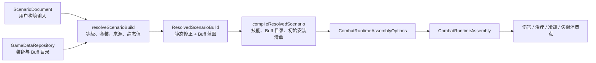

# Endaxis Next 装备常驻效果最小扩展方案

## 1. 目的与范围

本文承接 `equipment-battle-persistent-modifier-audit.md` 的 33 条严格审计，设计下一阶段能够闭环以下缺口的最小通用扩展：

- 20 条构筑期可确定、但当前 `EquipmentModifierDefinition` 无法表达的静态战斗修正；
- 12 条必须在战斗开始时安装，并在每次消费时重新判断条件的持久 Buff。

本文只定义类型职责、编译边界和运行时接线，不改变当前存档格式，也不把旧版 `Effect` 结构搬进 Next。32 条缺口必须由少量领域原语覆盖，禁止按装备 slug 或旧效果序号在核心中逐条分支。

## 2. 当前代码边界

当前实现已经具备以下基础：

- `ScenarioDocument.builds` 只保存干员、武器和装备的用户输入；
- `EquipmentModifierDefinition` 能描述四维、无范围面板项和伤害增益；
- `compileEquipment.ts` 能展开等级值并保留装备来源，但还不是完整 Build Resolver；
- `CombatBuffCatalogEntry` 是可序列化 Buff 目录边界，目前只开放原生八槽属性修正和少量已闭环生命周期动作；
- `CombatBuffDefinition` 是不可变运行时定义，已经能持有 `damageModifiers`、`attributeModifiers`；
- `DamageModifierDefinition` 已支持声明执行侧、伤害处理器和运行时条件回调；
- `CombatRuntimeAssembly` 接收已经编译好的技能、Buff 容器和运行时依赖，不读取 `ScenarioDocument` 或装备目录。

当前缺少的不是一个装备专用 `switch`，而是两段正式流水线：

1. `ScenarioDocument + GameDataRepository -> ResolvedScenarioBuild`；
2. `ResolvedScenarioBuild -> CombatRuntimeAssemblyOptions`。

因此装备扩展必须先进入解析产物，再由尚待实现的场景组合编译器统一装配。不得让 `CombatRuntimeAssembly` 反向查询装备 slug，也不得让 `compileEquipment.ts` 直接创建有状态的 Buff 实例。

## 3. 20 条静态 DSL 缺口

### 3.1 审计分组

| 语义         | 数量 | 范围       | 消费点       |
| ------------ | ---: | ---------- | ------------ |
| 治疗效率     |    9 | 装备者全局 | 治疗值计算   |
| 最终伤害减免 |    8 | 装备者全局 | 承伤最终阶段 |
| 技能冷却缩减 |    2 | 仅连携技   | 技能冷却计算 |
| 失衡伤害加成 |    1 | 仅处决     | 失衡值计算   |

这里的“静态”表示数值和范围在构筑解析时已经确定，不表示它必须显示在游戏面板，也不表示可以提前改写某个技能的基础数值。

### 3.2 建议的数据类型

建议把当前无范围的 `panelStat.skillCooldownReduction` 和 `panelStat.staggerDamagePercent` 逐步收敛到带语义范围的通用静态战斗修正。最小类型可以是：

```ts
type EquipmentStaticCombatModifierDefinition =
  | {
      readonly kind: 'healingEffect';
      readonly value: LevelValues;
    }
  | {
      readonly kind: 'finalDamageReduction';
      readonly value: LevelValues;
    }
  | {
      readonly kind: 'skillCooldownReduction';
      readonly skillTypes?: SkillType | readonly SkillType[];
      readonly value: LevelValues;
    }
  | {
      readonly kind: 'staggerDamageBonus';
      readonly skillTypes?: SkillType | readonly SkillType[];
      readonly value: LevelValues;
    };
```

通用字段只有 `kind`、`value` 和可选的 `skillTypes`。当前样本不需要任意字符串 scope，也不需要装备 ID 特判：

- 治疗效率和最终伤害减免不接受 `skillTypes`；
- 连携冷却缩减显式填写 `skillTypes: 'comboSkill'`；
- 处决失衡增益显式填写 `skillTypes: 'finisher'`；
- 无范围失衡增益省略 `skillTypes`。

采用可辨识联合而不是 `{ stat: string, scope?: object }`，可以让不合法的字段组合在类型和目录校验阶段失败。将来出现伤害类型、技能身份或治疗来源范围时，应先取得真实样本，再增加新的明确联合成员或经过约束的 scope，不提前开放任意过滤器。

### 3.3 Build Resolver 产物

Build Resolver 应把等级、词条档位、套装三件规则和 `main`/`secondary` 身份解析完，输出带来源的不可变值：

```ts
interface ResolvedStaticCombatModifier {
  readonly source: ResolvedEquipmentSource;
  readonly modifier:
    | { readonly kind: 'healingEffect'; readonly value: number }
    | { readonly kind: 'finalDamageReduction'; readonly value: number }
    | {
        readonly kind: 'skillCooldownReduction';
        readonly skillTypes?: readonly SkillType[];
        readonly value: number;
      }
    | {
        readonly kind: 'staggerDamageBonus';
        readonly skillTypes?: readonly SkillType[];
        readonly value: number;
      };
}
```

解析产物保留来源以支持诊断和分析，但消费层只按语义聚合。不同来源的同类值如何相加或相乘，必须由对应原生公式决定，不在装备 Adapter 中自行选择。

### 3.4 运行时消费点

- `healingEffect`：由未来治疗执行器在一次治疗结算时读取。它不是生命上限或攻击面板项，也不应通过 `CombatBuffDefinition.attributeModifiers` 伪装。
- `finalDamageReduction`：由玩家承伤流水线的最终减伤阶段读取。原生乘区闭环前只允许编译和携带，不得近似成防御、抗性或 `damageBonus` 的负值。
- `skillCooldownReduction`：场景编译时按 `skillTypes` 建立技能冷却修正索引，技能产生或刷新冷却时读取。它不改写技能目录定义，也不要求逐帧扫描所有技能。
- `staggerDamageBonus`：失衡结算时按当前技能类型筛选并聚合。它不进入普通伤害公式，也不修改 `dealDamage` 的倍率。

这些修正无战斗条件，因此不需要 Buff 生命周期。把它们装进永久 Buff 只会增加实例、注册和注销成本，并混淆“构筑确定值”与“战斗状态”。

## 4. 12 条持久 Buff 缺口

### 4.1 共同结构

12 条效果均满足：

- 所有者和受益者都是装备者；
- 无 duration、ICD、周期触发和叠层生命周期；
- 战斗条件会变化，不能在 Build Resolver 中提前求值；
- 效果只在一次伤害计算需要属性或伤害乘区时生效。

它们可由一个通用“永久条件伤害修正 Buff”模型覆盖，不需要 12 个专用 runtime 类。

| 修饰语义           | 数量 | 条件分布                                 |
| ------------------ | ---: | ---------------------------------------- |
| 攻击百分比         |    2 | 装备者生命比例                           |
| 暴击率             |    1 | 装备者指定 Buff 层数                     |
| 条件伤害加成       |    5 | 装备者生命比例 2、敌方状态 2、敌方失衡 1 |
| 对失衡目标伤害加成 |    4 | 敌方失衡 4                               |

换一个维度统计，运行时条件共为：装备者生命比例 4 条、敌方语义状态 2 条、敌方失衡 5 条、装备者 Buff 状态 1 条。这些条件只是数据，不应决定采用不同的安装流程。

### 4.2 装备 DSL

建议在装备贡献中增加纯数据蓝图：

```ts
interface EquipmentPersistentBuffDefinition {
  readonly key: string;
  readonly condition: CombatCondition;
  readonly modifiers: readonly EquipmentDamageTimeModifierDefinition[];
}

type EquipmentDamageTimeModifierDefinition =
  | {
      readonly kind: 'attackPercent';
      readonly value: LevelValues;
    }
  | {
      readonly kind: 'criticalRate';
      readonly value: LevelValues;
    }
  | {
      readonly kind: 'damageBonus';
      readonly damageTypes: DamageType | readonly DamageType[];
      readonly skillTypes?: SkillType | readonly SkillType[];
      readonly value: LevelValues;
    };
```

`key` 只在一个装备贡献内部区分多个蓝图。最终目录 ID 由编译器根据来源身份和 `key` 机械生成，配置作者不手写全局 Buff ID。

通用字段是 `condition` 和 `modifiers`。当前 12 条所需条件全部应复用已有 `CombatCondition`：

- `healthCompare` 表达装备者生命比例；
- `statusActive` 表达敌方语义状态；
- `targetStaggered` 表达敌方失衡；
- `buffStackCompare` 或 `buffIdStackCompare` 表达装备者 Buff 层数，具体采用哪一种由原始数据身份决定。

不得在装备 DSL 中增加 `operatorHp`、`enemyStatus` 等旧版条件名，也不得嵌入函数回调。条件身份无法从旧数据无歧义映射时，生成器继续 fail closed。

### 4.3 `CombatBuffCatalogEntry` 的最小扩展

`CombatBuffCatalogEntry` 是外部纯数据到 `CombatBuffDefinition` 的现有安全边界。建议为它增加声明式伤害时修正组，而不是让装备编译器直接构造带回调的低层定义：

```ts
interface CombatBuffCatalogDamageModifierGroup {
  readonly condition?: CombatCondition;
  readonly modifiers: readonly CombatBuffCatalogDamageTimeModifier[];
}

type CombatBuffCatalogDamageTimeModifier =
  | { readonly kind: 'attackPercent'; readonly value: number }
  | { readonly kind: 'criticalRate'; readonly value: number }
  | {
      readonly kind: 'damageBonus';
      readonly damageTypes: readonly DamageType[];
      readonly skillTypes?: readonly SkillType[];
      readonly value: number;
    };
```

字段名称描述稳定领域语义，不暴露 `DamageProcessorDefinition` 的 `zone`、`timing`、八槽属性位置或可执行 callback。这些低层细节由 Buff 目录编译器按已闭环规则产生：

- `attackPercent`、`criticalRate` 编译为伤害计算前的即时攻击方属性修正；
- `damageBonus` 编译为伤害计算的攻击方加成乘区，并保留伤害类型和技能类型过滤；
- 生成的 `DamageModifierDefinition.condition` 只能调用统一的声明式条件求值端口。

若攻击百分比、暴击率所对应的原生属性槽，或伤害加成乘区仍未闭环，目录可以先通过结构校验，但对应编译器必须明确报错，不能选一个看似接近的 slot/zone。

### 4.4 条件求值时机

永久 Buff 在 0 帧安装一次，条件不控制 Buff 的存在与否，而控制其修正是否参与当前消费：

1. Build Resolver 只解析条件树中的构筑常量，不读取当前生命、状态或 Buff 层数；
2. 场景编译器生成 Buff 目录项和装备者的初始 Buff 安装清单；
3. `CombatRuntimeAssembly` 创建各实体 Buff 容器后，在首个玩家输入前安装这些 Buff；
4. 每个 `DamageModifier.apply` 在对应伤害包的处理阶段调用统一条件求值器；
5. 条件求值器从当前伤害上下文和运行时实体端口读取装备者生命、敌方状态、敌方失衡及 Buff 层数。

这样不会因为状态变化而反复注册/注销修正，也不会引入额外的“状态开始/结束”事件顺序。一次伤害中的条件只在规定的处理阶段读取，保证同一帧内 Buff、状态和伤害的先后顺序仍由战斗程序决定。

现有 `CombatCondition` 的执行能力分散在技能操作执行器链中；实现时应抽取或组合一个只读 `CombatConditionEvaluator`，让技能条件和 Buff 伤害条件共享同一语义实现。不得在 Buff 编译器中复制第二套条件解析器。

### 4.5 Buff 生命周期与运行时消费

这些装备 Buff 的目录定义应使用：

- 无限持续时间；
- 唯一叠层身份；
- 无周期触发；
- 无生命周期回调；
- 一个或多个条件伤害修正组。

`CompiledCombatBuffCatalog` 将纯数据目录编译为 `CombatBuffDefinition`。Buff 实例启用后，现有 `CombatBuff` 会把 `damageModifiers` 注册到所有者的伤害修正集合；实际消费仍由伤害 runtime adapter 在每个处理阶段调用。装备系统不直接访问 `PlayerDamageContext`。

## 5. 编译边界与数据流



建议的中间产物至少包含：

```ts
interface ResolvedOperatorBuild {
  readonly operatorId: string;
  readonly staticCombatModifiers: readonly ResolvedStaticCombatModifier[];
  readonly persistentBuffs: readonly ResolvedEquipmentPersistentBuff[];
}

interface CompiledOperatorCombatLoadout {
  readonly operatorId: string;
  readonly skills: readonly CompiledSkillProgram[];
  readonly buffDefinitions: readonly CombatBuffDefinition<string>[];
  readonly initialBuffIds: readonly string[];
  readonly staticCombatModifiers: readonly ResolvedStaticCombatModifier[];
}
```

`ResolvedScenarioBuild` 不持有运行时容器；`CompiledOperatorCombatLoadout` 不持有可变 Buff 实例。组合层使用后者创建 `CombatOperatorProgram.buffRuntime`，注册静态消费索引，并在 `CombatInputRuntime.applyCurrentFrame()` 之前完成初始 Buff 安装。

## 6. 与主线 `ScenarioDocument -> runtime` 编译器的衔接

当前仓库尚无完整的 `ScenarioDocument -> CombatRuntimeAssembly` 编译入口。装备扩展应成为该入口的一段输入，而不是另建平行模拟器：

1. **项目校验**：继续只检查 build 结构和目录引用，不把目录效果复制进存档。
2. **场景解析**：根据轨道引用找到 `OperatorBuildDocument`、`WeaponBuildDocument` 和四件 `GearBuildDocument`，通过 `GameDataRepository` 读取定义并解析三件套。
3. **构筑解析**：调用装备贡献编译器展开等级，形成每名干员的静态修正和持久 Buff 蓝图。
4. **场景编译**：合并干员技能、天赋潜能、装备、活动机制和全局配置，产出唯一的 `CompiledOperatorCombatLoadout`。
5. **运行时装配**：把技能、Buff 容器、条件求值端口、静态消费索引和初始安装清单转换成 `CombatRuntimeAssemblyOptions`。
6. **模拟启动**：完成全部 0 帧初始化后，才允许 `CombatInputRuntime` 处理第一个输入。

装备与活动机制可以贡献同类静态修正或 Buff 蓝图，但二者保留不同来源身份。场景编译器负责统一排序、去重和稳定 ID；运行时不关心贡献来自武器、装备、套装还是活动。

## 7. 序列化边界

项目存档继续只保存：

- 武器和装备目录 slug；
- 用户选择的等级、潜能、词条等级和精锻等级；
- 干员与装备方案之间的引用关系。

以下内容均为目录或派生数据，不进入 `ScenarioDocument`：

- 静态修正的展开数值；
- 套装是否生效的计算结果；
- Buff 目录项、编译后的 `CombatBuffDefinition`；
- 初始 Buff 安装清单；
- 运行时 Buff 实例、条件真假和伤害修正注册状态。

导出项目依靠 `gameDataRevision` 重建这些产物。若未来需要导出可复现实验包，应另建带目录 revision 和编译产物摘要的诊断格式，不污染用户项目存档。

## 8. 实施顺序

### 阶段一：静态类型与解析产物

1. 增加四种静态战斗修正的可辨识联合；
2. 扩展 `compileEquipment` 的等级展开和严格字段校验；
3. 建立最小 Build Resolver，按干员聚合武器、装备和三件套贡献；
4. 先闭环连携冷却和处决失衡的已有消费点；
5. 治疗执行器和最终承伤阶段具备原生依据后，再开放对应运行时消费。

阶段一完成后重新运行 33 条审计，20 条应从 DSL gap 变为 definition-ready；不能执行的治疗/减伤条目应区分“定义已表达”和“运行时未消费”，不得宣称模拟闭环。

### 阶段二：声明式条件统一求值

1. 盘点技能执行器链中已有的 `CombatCondition` 求值能力；
2. 提取只读条件求值端口，保持目标绑定、容差和同帧状态读取语义一致；
3. 为伤害上下文补足条件所需的生命、状态、失衡和 Buff 查询端口；
4. 用技能条件和独立条件测试共同约束该端口。

### 阶段三：Buff 目录扩展

1. 给 `CombatBuffCatalogEntry` 增加纯数据伤害时修正组；
2. 严格解析允许字段和枚举，未知字段 fail closed；
3. 编译为现有 `CombatBuffDefinition.damageModifiers`；
4. 以攻击百分比、暴击率、条件伤害加成各选一个真实样本验证；
5. 禁止开放原始 `DamageProcessorDefinition` 或函数回调给数据文件。

### 阶段四：场景组合与 0 帧安装

1. 在主线场景编译器中接入 `ResolvedOperatorBuild`；
2. 创建每名干员的 Buff 容器和静态消费索引；
3. 在任何输入处理前安装永久 Buff；
4. 验证条件跨阈值、状态开始/结束和失衡开始/结束后，无需重装 Buff 即可改变结果；
5. 重新运行全量装备迁移审计，12 条应全部获得明确目录定义或暴露真正的数据证据缺口。

## 9. 明确不做的事情

- 不为 32 条效果增加 slug 分支或专用类；
- 不把动态条件在 Build Resolver 中求值；
- 不把治疗效率和最终减伤伪装成普通面板值；
- 不用状态开始/结束监听器反复启停永久 Buff；
- 不让装备 DSL 携带回调、低层伤害 zone 或原生八槽细节；
- 不把编译结果和运行时状态写回项目存档；
- 不在 `CombatRuntimeAssembly` 中读取目录或解析装备。

## 10. 验收标准

扩展完成后至少满足：

- 20 条静态缺口都能由四种通用语义表达，范围不会扩大；
- 12 条动态缺口都由同一永久条件 Buff 路径表达；
- 条件在实际伤害消费时读取当前状态，而不是读取开战快照；
- 同一条件在技能合法性、条件步骤和装备 Buff 中只有一套求值语义；
- 项目 JSON 与当前 schema 保持兼容，不新增派生字段；
- 所有目录和编译阶段对未知 kind、字段、scope 和条件显式失败；
- 运行时只消费已解析产物，不出现装备 slug 或旧版 Effect 分支。
