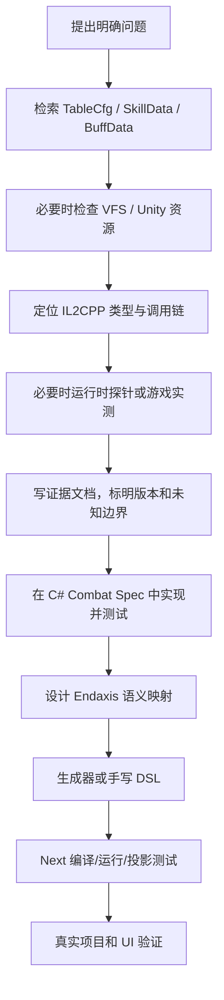

# 证据链与研究方法

## 1. 为什么需要多条证据链

终末地的战斗行为并不完整存在于某一个地方：

- TableCfg 描述角色成长、武器、装备、潜能、天赋和展示元数据；
- SkillData 描述技能动作图、条件、时序和技能引用；
- BuffData 描述 Buff 生命周期、属性修改、事件监听和嵌套动作；
- Unity 资源包含 Prefab、动画事件、投射物、范围实体和表现绑定；
- IL2CPP 原生代码实现通用执行器、伤害公式、资源系统、事件总线和条件语义；
- IFix 或热更新可能替换原生实现；
- 游戏 UI、录像和面板截图可以验证最终可见结果；
- 旧版 Endaxis 和社区资料包含宝贵经验，但也可能有猜测和历史错误。

因此不能只“找到一个数值”就结束。需要知道数值的来源、单位、应用阶段、版本、条件和运行时顺序。

## 2. 证据优先级

建议按以下优先级处理冲突：

1. 同版本运行时 trace、内存对象和确定的机器码调用链；
2. 同版本原始 SkillData、BuffData、TableCfg 和资源对象；
3. 可重复的游戏内面板、逐帧录像和输入实验；
4. C# Combat Spec 中有明确证据引用的测试；
5. AKEDatabase 前端的字段解释和展示逻辑；
6. 旧版 Endaxis 配置、社区文档和 AI 总结。

低优先级资料不是无效，而是应被当作待验证假设或回归参考。若低优先级结果与高优先级证据冲突，应修正配置和文档，而不是为兼容旧结论扭曲模型。

## 3. 一项规则如何进入 Endaxis

标准流程如下：

不是每个简单字段都必须走到运行时探针。例如武器基础攻击力可由 TableCfg 和游戏面板直接闭环。但涉及执行顺序、条件短路、事件监听和延迟扣费时，静态描述通常不够。

## 4. 研究问题必须足够具体

好的研究问题示例：

- 一个 hit 内同时包含 `CreateBuffAction` 和 `DamageAction` 时，数组顺序是否决定伤害能否吃到 Buff？
- 技能释放时先检查技力，`startCdTime` 延迟扣费失败后客户端如何处理？
- `AllowNextSkillAction.startFrame` 与通用中断帧分别控制什么？
- 连携窗口同时打开时，哪个窗口可以先消费？
- 潜能修改的是 SkillPatch 黑板、技能定义还是运行时属性？

不好的问题是“这个技能怎么实现”，因为它会混合展示、输入、资源、动作图、Buff 和伤害等多个层次。

## 5. 静态数据读取

### TableCfg

适合回答：

- 干员等级、突破、四维属性和成长关键帧；
- 武器等级、词条、技能等级和潜能补正；
- 装备主副属性、精锻和三件套效果；
- 敌人基础属性、抗性、失衡和处决倍率；
- 潜能、天赋和技能展示关系；
- 本地化键、富文本、图标和 UI 元数据。

### SkillData

适合回答：

- 根技能与子技能引用；
- `TimelineAction`、`SequenceAction`、条件分支和调度帧；
- Damage、Buff、资源、标签、投射物和实体动作；
- 普攻链、技能替换、AllowNextSkill 和中断相关配置。

### BuffData

适合回答：

- Buff 初始、启用、周期、事件和结束动作；
- 层数、持续时间、标签和叠加规则；
- 属性修改器和伤害处理器；
- 监听哪些 Ability/Buff/Global 事件；
- Buff 如何引用其他技能或 Buff。

### 严格解析原则

生成和验证脚本应：

- 校验数据版本；
- 对未知字段、未知枚举、未知 Action、未知图片和未知富文本标签报错；
- 对无法闭环的值不生成，而不是填零或照搬旧配置；
- 输出审计报告，区分自动生成、显式映射、近似和缺失；
- 不从旧干员 TS 偷取缺失值，若必须人工补充则写在独立配置 JSON 中。

## 6. VFS 与资源层研究

AKEDB 不含所有本地资源，因此使用 vfs-index-browser：

- `manifest.hgmmap` 恢复逻辑路径到 Bundle 的映射；
- VFS 索引确定加密压缩块中的文件边界；
- 按需读取目标文件，避免全量解包数小时；
- AB 内部 Container 再映射到具体 Unity 对象；
- AnimeStudio 解析 Unity 对象、动画和 Shader；
- SparkBuffer/MemoryPack/Wwise 使用专用解析器。

这个层次尤其适合验证：投射物、范围实体、Prefabs、动画片段、材质参数、音频媒体和未在 AKEDB 发布的二进制配置。

## 7. IL2CPP 与运行时研究

静态流程：

1. 从 metadata/dump 建类型和方法索引；
2. 根据类名、字段、字符串、调用者和被调用者定位候选；
3. 对 RVA 反汇编；
4. 恢复条件、字段偏移、调用顺序和分支；
5. 检查 IFix 是否替换原生方法。

运行时流程：

1. 使用版本化 MethodProbes 清单；
2. 用户启动游戏和 Dumper；
3. 一次尽可能批量采集安全的只读方法和内存；
4. 将 bin/json 拉回本地；
5. 生成可读的 `*.analysis.json`；
6. 记录游戏版本、模块哈希和探针版本。

运行时探针不是默认第一步。只有静态数据无法回答、IFix 影响明显或需要证明实际调用顺序时才使用。

## 8. C# Combat Spec 的角色

Combat Spec 要求所有行为有反编译或配置依据。它使用以下状态标记：

- `Confirmed`：直接证据闭环；
- `Inferred`：多个证据一致但仍缺直接闭环；
- `Unknown`：明确未知，不实现猜测。

当文字文档说“先应用 Buff，再计算伤害”时，Combat Spec 应提供一个有序 `SequenceAction` 测试，证明 trace 和伤害结果都符合该顺序。这样可防止后续维护者对文字产生不同理解。

Combat Spec 与 Endaxis Next 的区别：

- Spec 优先忠实于游戏，包括客户端内部看似繁琐的生命周期；
- Next 优先表达排轴所需的语义，可舍弃选目标、敌人 AI、表现动画等无关部分；
- Next 的每项简化都应能追溯到 Spec 或证据文档，并说明为什么在单敌人排轴假设下行为等价。

## 9. 生成器的角色

生成器位于 Endaxis 仓库，负责把原始数据转换成可读、可审计的 Next DSL。它不是一个宽松的 JSON 转 TS 格式化器。

生成过程包含：

- 解析干员展示技能、根 SkillData、递归 Skill/Buff 引用；
- 将原生 Action 映射为 Endaxis 语义 step；
- 应用 SkillPatch 黑板和等级值；
- 生成技能、天赋、潜能和静态属性修改；
- 合并诀等双形态的共享身份与展示变体；
- 生成审计 JSON/Markdown 和针对性测试；
- 对不支持的行为给出明确缺口。

宽松模式仅用于尽快在 UI 展示基本信息。它必须标记“不完整”，不能让缺失机制悄悄进入正式模拟。

## 10. 游戏内实测

实测用于验证最终结果和补足静态语义。已经采用过的样本方法包括：

- 固定干员等级、潜能、技能等级和武器；
- 逐件增加装备或改变精锻；
- 记录游戏内面板截图；
- 用 `PanelSnapshot` 输入预测值与观察值；
- 用录像逐帧核对普攻链、技能块体感时长和命中延迟。

实测必须保存完整构筑条件。诸如“0+1”是社区约定而非 UI 原生术语，文档中应写清角色潜能和武器额外抽取次数，避免歧义。

## 11. 版本与可追溯性

每份关键证据至少记录：

- 游戏或 AKEDB 数据版本；
- 源文件逻辑路径或 CDN 路径；
- 原始 ID；
- 使用的工具提交；
- 结论等级；
- 尚未确认的边界。

游戏更新后不能直接把新 TableCfg 与旧 runtime dump 混用。应先建立版本清单，必要时重新生成 DSL 和审计报告，再由差异决定哪些运行时结论需要复测。
