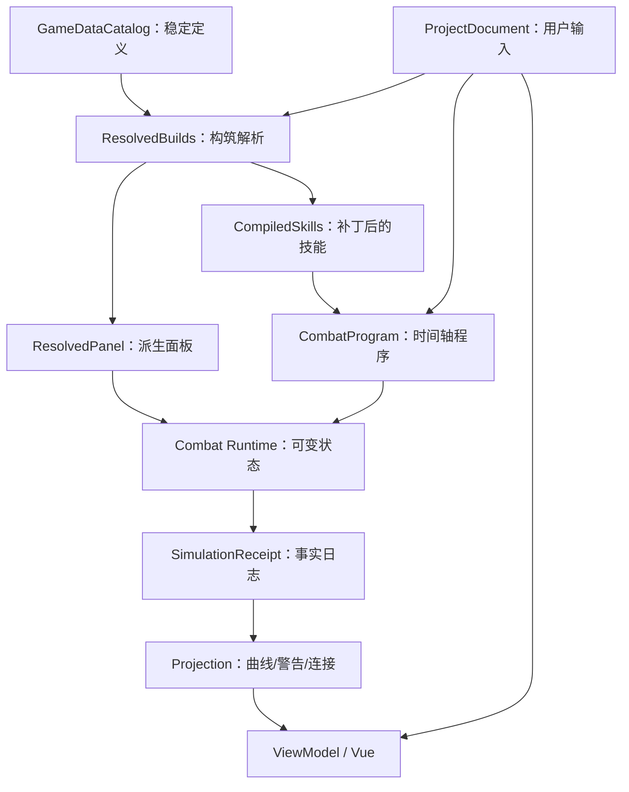

# Endaxis Next 架构

## 1. 总体原则

Endaxis Next 位于 `src/next`，是与旧版并行的新实现。它共享必要的游戏数据和视觉参考，但不共享旧版项目状态、模拟器、持久化类型或 UI 状态。

核心原则：

- 存档只保存用户输入；
- 游戏定义、编译产物、运行时状态、回执和 UI 投影互相分离；
- 依赖方向从 UI 指向应用、核心和数据接口，核心不依赖 Vue；
- i18n 只在渲染边界发生，核心只保存稳定身份和结构化参数；
- 主题使用语义 token，业务组件不散落硬编码色值；
- 特殊干员和活动机制通过明确扩展点接入；
- 每一步都能单测，模拟尽量确定性和纯函数化。

## 2. 目录分层

```text
src/next/
  application/       用例编排：打开项目、运行模拟
  core/
    project/         项目 schema、校验、序列化、迁移
    game-data/       游戏定义接口和目录校验
    compiler/        项目 + 定义 -> 编译产物
    mechanics/       可组合特殊机制与活动扩展
    simulation/      帧循环、资源、Buff、状态、伤害、事件
    pipeline/        端到端模拟流水线
    projection/      回执 -> 曲线、警告、变化点
  data/
    operators/       干员 DSL、helper、生成产物
    equipment/       武器、装备、套装适配和目录
    enemies/         敌人定义与目录
    gameDataCatalog  正式目录组装
  ui/
    timeline/        页面、组件、编辑命令和 ViewModel
    keyboard/        快捷键作用域路由
    theme/           主题注册和 token
    legacy/          受控的旧展示/数据适配
```

旧数据只能通过明确适配层进入 Next。核心模块不能直接 import 旧 store、旧 Vue 组件或翻译实例。

## 3. 端到端数据流



任何 UI 显示问题都应先判断它属于哪个阶段。例如“技力不足角标和黄线不一致”不是加两个独立算法，而应让二者投影同一份资源回执。

## 4. 存档

存档是 authoring document，不是运行时快照。应保存：

- `schemaVersion`、`gameDataRevision` 等版本信息；
- 轨道和干员稳定 ID；
- 干员等级、突破、潜能、技能等级、天赋状态和用户可编辑默认值；
- 武器、词条等级和装备精锻；
- 敌人和场景输入；
- 技能组放置、逻辑帧、连接和布局；
- 项目级机制配置；
- 哪些默认值被用户显式编辑。

不应保存：

- 本地化后的技能名和游戏文本；
- 计算后的面板；
- 编译后的 step、Buff 和事件监听器；
- 模拟日志、折线、伤害期望和警告；
- hover、selection、undo 栈；
- 语言和主题等设备偏好。

“可编辑默认值”需要保存实际值，确保项目重开结果稳定；同时保存 `edited` 标记，使未来用户主动选择“按新版本数据刷新默认值”时，只更新未编辑项。

## 5. 稳定身份与派生数据

时间轴 action 的身份应由稳定字段推导：轨道/干员身份、`skillKey`、`segmentIndex`、攻击段等。显示名称在加载后由这些身份重新本地化。

历史问题表明，匿名 patchHit 或动态 effect 若缺稳定 ID，恢复历史时重新分配 UID 会造成派生对象不相等，破坏连续撤销。Next 的原则是：

- 用户拥有的实体有稳定 ID；
- 纯派生 step 不为“看起来完整”而分配仪式性 ID；
- 只有可渲染、可连接的伤害命中需要稳定 `hitId`；
- Buff、条件、资源变化等未渲染子 step 不持久化随机 ID；
- 恢复项目后重编译派生对象，但结果必须由稳定输入确定。

## 6. 游戏定义 DSL

### 技能组

技能以具名对象存在，并由技能组组织。技能组 `skills` 可以是单个技能或有序数组：

- 普攻链是数组，一次拖放展开为多个 cast；
- 战技、连携、终结技、处决和下落攻击通常是独立技能组；
- UI 显示技能类型，具体技能名用于 tooltip 或详情；
- `variants` 不应作为技能组 kind，形态展示由 `presentationVariants` 表达。

### 技能内部

```text
SkillDefinition
  -> scheduledSequences(startFrame)
     -> ActionSequence
        -> CombatStep[]
```

`CombatStep` 使用 discriminated union。典型 kind 包括：

- `dealDamage`
- `applyBuff`
- `applyElementalInfliction`
- `changeResource`
- `conditional`
- `dispatchEvent`
- 其他有证据的语义动作

数组顺序是同帧执行顺序的唯一事实。条件持有完整 `whenTrue` / `whenFalse` 序列，而不是把同一条件复制到每个叶子。

### LevelValues

等级值定义为：

```ts
type LevelValues = number | readonly number[];
```

单值表示所有等级相同；数组表示逐等级值。倍率 DSL 使用百分比表达，生成代码应适当换行，避免一整行塞入长数组和 step。

### Helper

`definitionHelpers.ts` 只提供可复用语法构造，例如某元素普攻、百分比、条件和有序序列。它不能包含某个干员专属机制，也不能执行模拟逻辑。

## 7. 构筑与编译器

编译器负责把用户构筑和目录定义转成不可变、可执行的派生数据：

1. 解析干员等级、突破、技能等级、天赋和潜能；
2. 解析武器、词条等级、装备和套装；
3. 合并静态属性修改；
4. 计算最终面板；
5. 对技能定义应用潜能、天赋、武器和装备 patch；
6. 解析资源上限、初始值、回复效率和成本；
7. 将项目时间轴编译为 combat program。

当前已经有 `resolveScenarioBuilds`、`resolveOperatorPanel`、`compileOperatorUpgrades`、`compileEquipment`、`compileSkill`、`compileScenarioTimeline`、`compileScenarioResources` 和 `resolveScenarioResourceRules` 等明确入口。

资源规则的事实应集中解析。例如终结技能量上限来自补丁后的终结技成本，回复倍率来自最终面板，调用者不再维护一份手写 operator resource facts。

## 8. Mechanic 扩展

Mechanic 用于表达不适合塞入通用技能 step、但会向编译或运行时贡献行为的机制，例如：

- 干员专属常驻机制；
- 武器或套装持续效果；
- 活动规则，如危机合约或影拓丰碑；
- 场景级资源、属性或事件修改。

一个 mechanic 应通过声明式 contribution 接入编译器或运行时，不能直接 import UI/store 修改全局变量。它需要：

- 稳定 ID 和类型；
- 明确输入参数；
- 校验；
- 编译贡献；
- 必要的运行时 handler；
- 测试和证据说明。

通用 step 能表达的行为不应为了“扩展性”包装成 mechanic；只有跨技能、持续监听或场景级规则才值得进入该层。

## 9. 战斗运行时

运行时接收编译后的程序和初始状态，按固定 30 FPS 逻辑帧推进。核心对象包括：

- 帧调度器和同帧序号；
- 角色/敌人属性与状态；
- 技力、终结技能量等资源；
- Buff 实例与标签；
- 技能 cast 上下文和 Blackboard；
- 语义事件总线；
- 伤害与失衡处理；
- 元素附着和反应；
- 结构化 trace/receipt。

运行时不能读取 UI 文本，也不能边运行边查旧版 operator TS。所有必要数据在编译阶段准备好。

合法性诊断与执行分离：执行仍按项目动作发生，诊断从资源、状态和窗口回执判断问题。终结技能量不足优先于终结技冷却等显示优先级属于投影/诊断 reducer，而不是改变底层执行顺序。

## 10. 回执与投影

运行时输出事实回执，例如：

- 技能开始/结束；
- 资源变化；
- Buff 添加、层数变化和结束；
- 伤害、失衡和附着；
- 条件检查结果；
- 事件分发；
- 诊断所需状态。

投影层是纯读取层，负责：

- SP/终结技能量/失衡曲线；
- 状态变化点；
- 技能合法性警告；
- 技能块连接端点；
- 战斗日志和分析面板数据。

投影不能为某个干员重新模拟一遍条件，也不能维护另一份资源账本。

## 11. 应用层与 UI

应用层将“打开项目”“运行模拟”等用例封装为稳定入口。UI 通过 ViewModel 和 command 操作存档：

- command 产生新文档或补丁；
- undo/redo 保存项目状态，不保存派生模拟对象；
- ViewModel 将项目和投影整理为组件需要的数据；
- Vue 组件只处理渲染、输入和局部交互状态。

当前页面 `NextTimelineEditor.vue` 已拆出轨道头、标尺、资源曲线、技能块、连接层、选择弹窗、构筑面板和工具栏等组件。快捷键使用 `keyboardShortcutRouter` 逐步建立作用域；临时的 DOM 弹窗判断应在后续统一成显式 focus scope 栈。

## 12. i18n 与主题

i18n 原则：

- 核心和数据编译层只保存文本 key、游戏实体 ID 和参数；
- 游戏内容文本与界面文本可以使用相似加载接口，但命名空间和来源分开；
- 游戏语言包按需加载，不把所有语言一股脑打进本地 bundle；
- 可编辑方案名允许保存用户文本，默认名可在创建时本地化；
- 项目导出后在另一语言环境加载，应根据身份重新得到名称。

主题原则：

- `themeRegistry` 注册黑/白及未来主题；
- 组件使用背景、文本、边框、警告、技能类型等语义 token；
- 不在领域层携带颜色；
- 旧版视觉复刻通过 token 和组件样式完成，而不是复制一套业务逻辑。

## 13. 性能策略

性能优化优先使用简单明确的手段：

- 编译产物不可变，可按项目输入做结构共享或缓存；
- 运行时使用整数帧和紧凑事件队列；
- 投影从 receipt 单次遍历生成变化点；
- UI 只渲染可视区和必要派生数据；
- 不在 render 中重复编译或模拟；
- benchmark 放在 `src/next/benchmarks`，以真实场景和正确性测试为前提。

不要为了微小性能收益引入难以审计的 ECS、跨层缓存或隐式全局单例。

## 14. 旧版兼容与切换

- 旧项目通过专用 importer 迁移到新 schema；
- 迁移结果必须通过与新项目相同的校验；
- 新代码只写新版格式；
- 当前 breaking change 允许不兼容更早实验版本，但重构完成后的正式版本必须有稳定 schema 和迁移策略；
- `/timeline` 在切换前不应被 Next 开发顺手修改；
- UI 可以参考或复制旧组件样式，但新功能写入 `src/next`。
