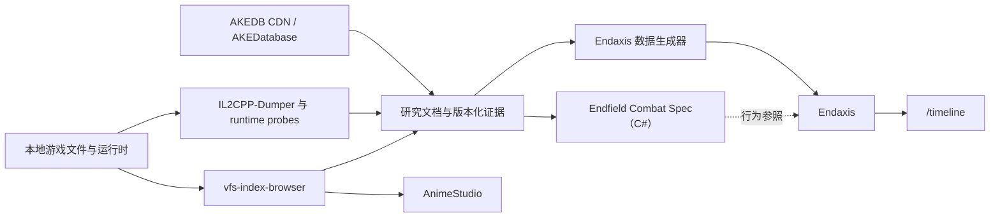

# Endaxis 全局交接文档

这套文档面向**完全没有参与过本项目、不了解此前对话，也不熟悉相关工具链的 AI 或开发者**。它不仅介绍 Endaxis，还说明项目如何从《明日方舟：终末地》的静态数据、游戏资源和运行时代码中取得证据，以及这些证据怎样进入 C# 行为规格、数据生成器和当前 Endaxis 实现。

这里记录的是可复核的工作背景、项目边界、设计决策、当前状态和操作入口，不记录不可验证的思维过程。遇到文档和代码冲突时，应以同版本原始数据、运行时证据和当前代码测试为准，并及时修订文档。

## 推荐阅读顺序

**当前最高优先级（2026-09-09 用户决定）：**先读
[统一事件监听链路](2026-09-09-event-unification-priority.md)。先审查并消除按监听宿主
重复实现事件的架构问题，再恢复下述真实轴扩展与伤害显示工作；此次仅立项，尚未修复。

2026-09-09 接续优先读 [真实轴审计与推送检查点](2026-09-09-real-axis-checkpoint.md)，
再读当前快照。当前主线为真实分享轴模拟与展示审计，不是无关编辑器扩展。

2026-09-08 接续先读 [真实旧轴、性能与公共 Buff 检查点](2026-09-08-real-axis-performance-checkpoint.md)。当前主线是真实旧轴伤害归因，拖动性能已由用户验收；编辑器历史见 [晚间干员定义编辑器检查点](2026-09-08-operator-editor-checkpoint.md)。再进入当前快照与设计文档。

接续当前编辑器工作时，先读 [当前任务快照](current-context.md) 的晚间检查点，再读
[Inspector 架构](../../tools/inspector-schema/README.md) 与
[定义工作区统一设计](../next/10-editor-ui-model.md)。前者规定契约、注解、句柄、注册表和
图/Inspector 分工，后者规定页面、导航和保存范围；不要将旧切片中的迁移状态当作现状。

**编辑器设计原则：自由编辑与严格模拟并行。** 模拟校验不是编辑权限；操作映射、
中断、资源、冷却等检查不通过，不得阻止用户放置、移动或紧凑排列技能。
编辑保留用户指定的技能和时刻，模拟如实报告错误与告警，由用户决定如何处理。
不能为了让校验通过而偷偷替换技能、消除告警或裁掉效果。编辑工具只限制自身必要的
结构条件（例如紧凑排列要求同轨多选），异步结果仍须遵守取消、版本检查和撤销事务。
模拟无法提供布局建议时，应保留编辑意图并使用明确的布局回退，而不是取消编辑。

接续统一 TS 编译器时，先读 [当前任务快照](current-context.md)。需要追溯标签、倒地和余烬阶段的
历史决策时，再读 [2026-08-28 同步交接检查点](2026-08-28-sync-checkpoint.md)；其中的覆盖数字、
分支和“下一步”均是历史快照，不能覆盖当前任务快照。

1. [背景、目标与历史](./01-background-and-goals.md)：项目为何存在，旧版 Endaxis 有什么问题，Next 要交付什么。
2. [项目与工具总览](./02-projects-and-tools.md)：AKEDatabase、VFS 浏览器、AnimeStudio、IL2CPP Dumper、C# Combat Spec 等分别做什么。
3. [证据链与研究方法](./03-evidence-and-research-method.md)：一项游戏规则如何被发现、验证、复刻并进入生产代码。
4. [战斗系统研究结论](./04-combat-system-findings.md)：当前已经串起的原生战斗架构、执行顺序、资源、技能、Buff 与伤害模型。
5. [Endaxis Next 架构](./05-endaxis-next-architecture.md)：新版代码分层、领域模型、编译与模拟流水线、项目格式、UI 边界。
6. [当前状态与路线图](./06-current-state-and-roadmap.md)：当前分支、近期提交、已完成能力、AKEDB 数据情况和后续优先级。
7. [操作与恢复手册](./07-operations-playbook.md)：仓库路径、命令、服务、验证方式、远程环境和恢复任务时的检查清单。
8. [当前任务快照](./current-context.md)：变化最快的短期状态，只用于快速恢复当前会话。

若当前分支为 `refactor/common-game-data` 或 `refactor/operator-completion`，还必须阅读
[`tools/game-data-compiler/README.md`](../../tools/game-data-compiler/README.md)。它是统一 TypeScript
游戏数据编译器的实现契约，优先于后文保留的旧 Python 生成器历史描述。
涉及生成结构时还必须阅读[独立游戏数据契约](../../packages/game-data-contract/README.md)：
转换器与本体不得相互依赖；结构的唯一归属、数据转换图与等级边界以该文档为准。

## 一句话总览

Endaxis 是一个《明日方舟：终末地》战斗时间轴编辑器和模拟器。新版领域模型、项目格式、数据编译、战斗运行时和 UI 已提升为 `src` 下唯一正式实现；游戏事实来自 AKEDB、游戏本地 VFS、IL2CPP 反编译与运行时探针，先进入可审计的研究文档和 C# Combat Spec，再以行为一致、适合编辑器维护的形式进入 Endaxis。

## 项目关系图

## 文档职责边界

- `docs/handoff`：跨仓库总览、当前工作状态和接手操作说明。
- `docs/next`：Endaxis Next 长期架构说明，面向已经知道项目背景的开发者。
- `docs/architecture`：专题设计、历史决策和迁移方案。
- `docs/research`：具体干员、原生 Action、Buff、装备和生成覆盖率的证据记录。
- `vfs-index-browser/docs`：本地游戏资源、格式、模型、音频、Shader 和战斗逆向研究。
- `vfs-index-browser/combat-spec/docs`：C# 原生行为复刻的模块说明和证据边界。

## 重要警告

- 旧版 Endaxis 已从当前工作树删除；需要核对其 UI 行为时，只读参照 `D:\Projects\Endaxis-upstream-main` 的代码。旧配置与旧实现不是游戏事实来源。
- AKEDB 提供了大量结构化数据，但并不保证包含每个技能的根 `SkillData`、帧时序或运行时硬编码。
- C# Combat Spec 追求按证据 1:1 表达原生行为；Endaxis Next 追求在单敌人排轴场景下行为一致、结构清晰，不要求复制游戏内部类名和所有与排轴无关的系统。
- 未证实的信息必须保持 `unknown` 或生成失败，不能用看似合理的默认值掩盖缺口。
- 当前工作树以用户主动搁置后的状态为准。先前关于梨诺、新武器和部分导出脚本的修改是被搁置，不是丢失。
