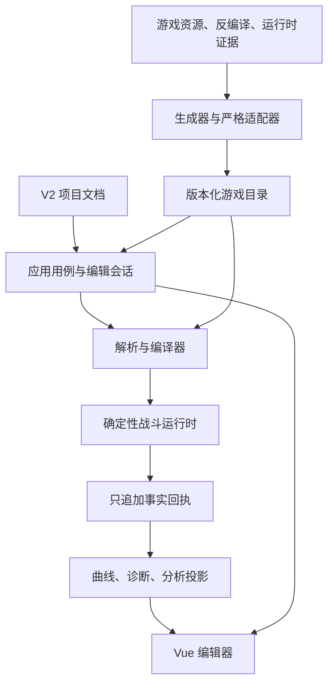

# Endaxis Next 分层架构

## 1. 总体结构



核心依赖方向是从稳定输入流向派生结果。下层不得回读 UI 或项目 Store，上层不得复制下层规则。

## 2. 仓库目录

```text
src/next/
├─ application/       应用用例、项目加载、编辑会话、场景模拟入口
├─ core/
│  ├─ project/        V2 项目格式、校验、序列化、迁移端口
│  ├─ game-data/      稳定领域定义和只读目录接口
│  ├─ compiler/       build、面板、技能、装备、敌人和场景编译
│  ├─ mechanics/      关卡、活动和自定义规则的受控扩展
│  ├─ combat/         框架无关的战斗核心
│  ├─ projection/     从回执派生曲线与诊断
│  └─ pipeline/       可取消、可缓存的阶段编排基础设施
├─ data/              当前游戏版本的数据定义与旧数据适配器
├─ ui/                Vue 组件、ViewModel、交互、i18n 边界和主题
└─ benchmarks/        核心性能基准
```

## 3. 各层职责

### 3.1 `core/project`

定义用户真正拥有、需要持久化的稳定输入。关键文件：

- `schema.ts`：V2 文档唯一事实来源。
- `validation.ts`、`scenarioValidation.ts`：纯结构和场景约束校验。
- `catalogValidation.ts`：结合游戏目录校验引用。
- `serialization.ts`：版本识别、解析与序列化边界。
- `migration.ts`：旧格式迁移端口。
- `createProject.ts`：合法空项目和场景的创建入口。

该层不知道 Vue、模拟器实例、翻译文本或面板结果。

### 3.2 `core/game-data`

定义 Endaxis 自己的领域 DSL。关键文件：

- `operatorDefinition.ts`：干员、技能组、技能、条件和有序 CombatStep。
- `equipmentDefinition.ts`：武器、装备、套装和贡献。
- `enemyDefinition.ts`：敌人目录结构。
- `gameDataRepository.ts`：核心使用的只读查询端口。

这里描述“游戏对象是什么”，不描述“用户选了什么”或“本场战斗当前怎样”。

### 3.3 `data`

承载具体版本的数据和适配器：

- `gameDataCatalog.ts` 装配默认只读目录。
- `operators/` 保存人工审核或生成后整理的干员定义。
- `equipment/` 将当前共享数据适配为 Next 设备定义。
- `buffs/` 保存带版本号的 Buff、附着和复合状态目录。
- `adapters/` 是允许接触旧数据形状的隔离层。

核心层依赖接口，不直接依赖旧版 Store 或数据文件结构。

### 3.4 `core/compiler`

把项目引用和等级化目录编译成单场战斗可直接消费的不可变对象。它包括：

- build 引用解析；
- 干员面板计算及来源 receipt；
- 技能等级值展开；
- 武器、装备、套装贡献编译；
- 敌人实例编译；
- 时间轴输入编译；
- 运行时装配参数生成。

编译器不创建跨场景状态，也不执行战斗。

### 3.5 `core/combat`

框架无关的确定性战斗核心。内部继续按职责拆分为：

- `actions`：同步有序动作序列。
- `runtime`：时钟、技能、资源、实体状态和责任链接线。
- `damage`：伤害公式与 DamagePack 生命周期。
- `buffs`、`status`、`infliction`：不同语义的状态系统。
- `attributes`：属性修正聚合。
- `events`：同步事件分发。
- `receipt`：事实输出。
- `timeline`：相对技能帧调度。

### 3.6 `core/projection`

只读取回执和稳定初始状态，输出：

- 技力与终结技能量曲线；
- 失衡变化点；
- 元素附着和语义状态变化点；
- 技能可用性与执行期诊断。

投影不修改战斗状态，不重新实现公式。

### 3.7 `application`

负责组合用例：

- 打开和迁移项目；
- 执行编辑命令与维护撤销历史；
- 解析场景并启动模拟；
- 选择具体运行环境；
- 冻结并返回适合 UI 使用的结果。

它可以依赖 core 和 data，但不应包含角色特殊规则。

### 3.8 `ui`

负责输入和展示：组件、交互状态、ViewModel、快捷键作用域、主题和 i18n。UI 只能通过应用命令修改项目，通过投影读取模拟结果。

## 4. 强制依赖规则

```text
ui -> application -> core
ui -> data（只读展示查询）
application -> data + core
data -> core/game-data
compiler -> project + game-data
combat -> compiler 产物 + combat 内部模块
projection -> receipt/稳定快照
```

禁止方向：

- `core` 导入 Vue、Pinia、浏览器 API 或 i18n。
- 编译器读取 UI 选择、全局 Store 或旧模拟结果。
- 项目文档保存编译产物、Buff 实例、曲线或翻译文本。
- 投影反向写运行时或自行执行技能规则。
- 干员定义嵌入任意函数回调或 UI 组件。

## 5. 扩展点

- 新干员、武器、装备：扩展版本化目录和生成器，不改项目结构。
- 新活动：实现 `MechanicAdapter`，编译为受控 Contribution。
- 新诊断或图表：从 receipt 增加投影，不侵入模拟器。
- 新主题：注册完整语义 token，不修改战斗颜色。
- 新旧数据源：实现 Adapter，核心接口保持稳定。
