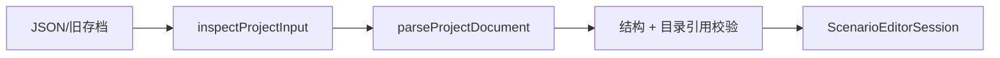
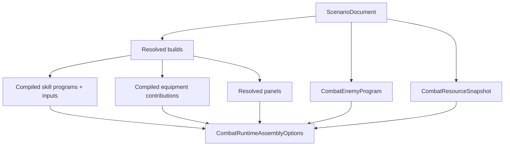

# Endaxis Next 端到端数据流

本文沿着一次真实用户操作说明数据从哪里来、经过什么对象、最终在哪里展示。

## 1. 页面启动和目录加载

路由 `/next/timeline` 加载 `src/next/ui/timeline/NextTimelineEditor.vue`。路由元数据声明需要的游戏文本族，`src/router/index.ts` 在进入页面前按需加载干员、武器、装备和术语文本。

页面使用 `src/next/data/gameDataCatalog.ts` 提供的 `nextGameDataRepository`。该对象同时实现：

- `GameDataRepository`：供编译器按稳定 ID 查询；
- `GameDataBrowser`：供 UI 枚举选择项。

游戏名称不进入核心定义，也不进入项目存档。

## 2. 创建或加载项目



关键文件：

- `core/project/serialization.ts`
- `core/project/validation.ts`
- `core/project/catalogValidation.ts`
- `application/openProject.ts`
- `application/editor/scenarioEditorSession.ts`

加载边界先识别 schema 版本。旧格式必须通过 `LegacyProjectImporter` 转成 V2，再走和新文档相同的校验。加载过程中不能偷偷补算面板或模拟结果。

## 3. 用户编辑

用户选择干员、武器、装备和敌人，或在时间轴上放置、移动、复制、删除技能。UI 不直接修改深层对象，而是调用纯命令生成新场景，再交给 `ScenarioEditorSession.commit()`。

主要入口：

- `application/editor/loadoutBuildFactory.ts`
- `application/editor/enemyEditorCommands.ts`
- `ui/timeline/loadoutBuildCommands.ts`
- `ui/timeline/timelineDocumentCommands.ts`
- `ui/timeline/placeSkillGroup.ts`
- `ui/timeline/timelineClipboard.ts`
- `application/editor/scenarioEditorSession.ts`

Session 保存项目快照和历史游标；选择、悬停、拖拽状态不进入项目历史。

## 4. 解析构筑和面板

```text
ScenarioDocument
  -> resolveScenarioBuilds
  -> Operator/Weapon/Gear definitions
  -> resolveScenarioOperatorPanels
  -> ResolvedOperatorPanel + panel receipt
```

关键文件：

- `core/compiler/resolveScenarioBuilds.ts`
- `core/compiler/resolveOperatorPanel.ts`
- `core/compiler/compileScenarioEquipment.ts`

面板计算以项目中的等级、突破、潜能、信赖、技能等级、武器和装备实例为输入。输出是派生快照和来源明细，不写回存档。

## 5. 编译场景

`compileScenarioRuntimeAssembly()` 是当前完整场景编译边界：



关键文件：

- `core/compiler/compileScenarioRuntimeAssembly.ts`
- `core/compiler/compileScenarioTimeline.ts`
- `core/compiler/compileScenarioResources.ts`
- `core/compiler/compileScenarioEnemy.ts`
- `core/compiler/combatProgram.ts`

编译后的 `CompiledSkillProgram` 已展开技能等级，动作严格按 sequence 顺序保存。它不再引用 Vue 对象或可变目录。

## 6. 环境能力预检

完整战斗环境尚在建设时，某些应用入口只支持已闭环子集。标准生命伤害入口使用 `standardPlayerDamageCompatibility.ts` 检查本次结束帧前真正可达的技能动作。

预检发生在运行时推进之前：

```text
编译产物 -> 能力预检 -> 全部通过 -> 创建并推进模拟
                    -> 存在问题 -> 聚合错误，零战斗副作用
```

这避免技能已扣费或已造成部分伤害后才遇到未实现步骤。预检问题使用稳定 code 和编译路径，UI 可自行翻译。

## 7. 运行战斗

`CombatRuntimeAssembly` 组装：

- 单调递增的 `CombatClock`；
- 技力和终结技能量账本；
- 敌人及各干员的单场状态所有者；
- 技能运行时和动作黑板；
- 资源、Buff、状态、条件和伤害执行责任链；
- 已编译的用户输入；
- 只追加 `CombatReceiptCollector`。

应用入口 `executeCompiledScenarioSimulation()` 只负责推进已编译场景并冻结结果。专用环境不得复制这套推进和投影逻辑。

关键文件：

- `core/combat/runtime/combatRuntimeAssembly.ts`
- `core/combat/runtime/combatSimulation.ts`
- `core/combat/runtime/skillRuntime.ts`
- `core/combat/runtime/combatInputRuntime.ts`
- `application/runScenarioSimulation.ts`
- `application/runStandardPlayerDamageScenarioSimulation.ts`

## 8. 回执和投影

运行时在事实发生现场记录 receipt，例如技能输入、费用变化、伤害、失衡、状态和附着变化。模拟结束后，projection 将这些事实转换为 UI 所需模型。

```text
CombatReceiptEntry[]
  ├─ resourceCurves.ts               -> 技力/终结技能量曲线
  ├─ poiseChangePoints.ts            -> 失衡变化点
  ├─ elementalInflictionChangePoints -> 附着变化点
  ├─ statusChangePoints.ts           -> 状态变化点
  └─ skill*Diagnostics.ts            -> 技能合法性诊断
```

新增视图优先增加 projection；只有缺少事实时才回到运行时补 receipt。

## 9. UI 展示

ViewModel 将项目、目录和投影结果整理成组件输入。组件只负责：

- 展示稳定身份对应的本地化名称；
- 绘制技能块、曲线、状态和告警；
- 把用户交互转换为应用命令；
- 管理本地选择、弹窗、焦点和拖拽状态。

最终形成完整闭环：

```text
用户输入 -> 项目命令 -> 新项目快照 -> 编译/模拟 -> receipt -> projection -> UI
```
