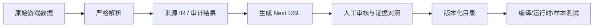

# Endaxis Next 数据生成与证据链

## 1. 原则

Next 的战斗数据不能来自“旧版配置大概是对的”。可执行规则需要至少一种可追踪依据：

- 解包后的 TableCfg、SkillData、BuffData 等资源；
- IL2CPP 反编译和方法探针；
- 运行时 dump 或 Hook；
- 可重复的游戏内录像、面板快照或战斗对照。

旧版 Endaxis 和社区文档可以帮助定位，但结论必须重新验证。

## 2. 数据进入代码的阶段

每一层都应暴露遗漏，不应静默过滤未知 action、黑板类型、标签或资源引用。

## 3. 干员生成器

入口位于 `scripts/generate_next_operators`：

- `generate_next_operators.py`：CLI 和总体编排。
- `source_schema.py`、`source_models.py`：来源结构和中间模型。
- `action_kinds.py`、`action_payload_parser.py`：动作类型与负载解析。
- `conditional_parser.py`、`target_parser.py`：条件和目标语义。
- `progression_renderer.py`：天赋、潜能和面板成长输出。
- `audit_all_operators.py`：全干员覆盖审计。
- `audit_recursive_mechanisms.py`：嵌套机制审计。

生成结果放在 `src/next/data/operators/generated`，审计结果放在 `docs/research`。人工整理后的正式定义位于 `src/next/data/operators`。

## 4. 严格模式与宽松模式

严格模式用于判断一个干员是否可以进入完整模拟：任何未知行为都失败。

宽松模式用于让 UI 尽早展示已有基础信息，但必须：

- 保留 unsupported/curated 审计记录；
- 不为未知步骤生成无效果占位行为；
- 在 UI 显示支持范围；
- 不宣称该干员已经完整可模拟。

“能显示”与“能准确模拟”是两个不同门槛。

## 5. Curated 配置

少量无法从通用源数据唯一推导、但已有外部证据的值可以写进生成配置。要求：

- 位于显式配置 JSON 或证据文件；
- 记录原因、来源和适用版本；
- 生成报告中标明；
- 不回读旧版 TS 作为隐式默认值。

Curated 不是自由手写规则的许可，而是可审计的证据补丁。

## 6. 证据与正式定义分离

正式干员 DSL 使用 Endaxis 领域语义，例如 `dealDamage`、`applyBuff`、`conditional`。原生类名、方法 RVA、内部 Buff ID 和投射物资源 ID 放在证据文件或生成中间层。

只有确实属于稳定目录身份、且运行时需要解析的原始 ID 才能进入正式数据。无法解释的 ID 不能被包装成看似可执行的字符串。

## 7. 武器、装备和敌人

武器和装备的静态/事件贡献定义见 `core/game-data/equipmentDefinition.ts`，当前共享数据通过 `data/equipment/adaptSharedEquipment.ts` 适配。长期目标仍是由明确源数据和独立生成配置产生 Next 定义。

敌人当前通过 `data/adapters/legacyEnemyCatalogAdapter.ts` 过渡接入。适配器只是隔离旧形状，不代表旧数据自动成为可信证据；处决倍率、失衡和其他关键值仍需源数据验证。

## 8. Buff 和元素目录

`src/next/data/buffs` 中的 JSON 带战斗版本号。加载器执行严格 schema 校验，再编译为运行时定义。目录变化必须更新 revision 和测试，不能让新旧战斗数据混用。

## 9. 测试层次

一项生成能力至少应有：

1. 来源 schema/未知字段失败测试；
2. 解析器单元测试；
3. 代表干员快照测试；
4. 全量覆盖审计；
5. DSL 编译测试；
6. 已闭环行为的运行时测试；
7. 有游戏样本时的端到端数值对照。

## 10. 相关研究材料

- `docs/research/all-operator-generation-audit.md`
- `docs/research/all-operator-recursive-mechanism-audit.md`
- `docs/research/operator-static-attribute-potential-audit.md`
- `docs/research/perlica-next-evidence.md`
- `docs/research/arcane-next-evidence.md`
- `docs/research/zhuang-fangyi-next-evidence.md`
- `docs/research/equipment-generation-ir-design.md`
