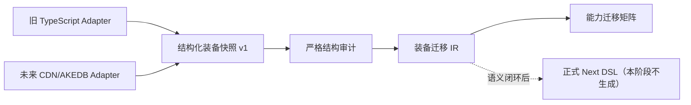

# Endaxis Next 装备生成 IR 设计

## 目的

装备生成 IR 位于外部数据源与正式 Endaxis Next DSL 之间，用于回答两个不同问题：

1. 旧数据或 CDN/AKEDB 数据能否被无损、严格地理解；
2. Next 的 Build Resolver、Buff、事件和运行时还缺少哪些能力。

只有第一个问题闭环，才能开始生成正式 DSL。IR 不应为了迎合当前尚不完整的运行时而丢字段，也不能把“已保存原始结构”误认为“已实现战斗行为”。

## 数据源边界

审计器和 IR 构建器只依赖快照契约。当前 Node/Vite 导出器只是旧 TypeScript 的一个 Adapter，未来接入 CDN/AKEDB 时无需改写分类规则。

## 每条 IR 的稳定信息

- 来源类型、slug、文件路径；
- 武器/装备技能槽、武器形态、effect 结构路径；
- 被动、trigger 或嵌套 hit 的位置身份；
- 迁移分类与是否可无损进入 IR；
- modifier、规范化 target、完整 trigger、condition 和生命周期；
- 正式 DSL 与运行时所需的能力标签；
- 结构化 `sourceEffect` 证据载荷。

`sourceEffect` 只用于迁移审计和对照，正式生成器不得直接透传。正式 DSL 必须从已枚举的语义字段生成，并再次做引用和能力校验。

每条记录同时保留两套状态：

- `irStatus` 表示源语义能否无损进入迁移层；
- `downstreamStatus` 表示它是已经具备静态定义条件，还是仍依赖核心 Buff、事件、条件、目标或生命周期能力。

二者必须分开。事件行为即使尚不能执行，也可以完整进入 IR；反过来，进入 IR 不代表可以立即生成正式 DSL。

## 分类规则

### 构筑期静态贡献

必须同时满足：

- 位于无 trigger 的被动区；
- `kind` 为 `status`；
- 目标为自身；
- modifier 属于构筑期可求值集合；
- 不带持续时间、叠层、条件、ICD 或动态 scaling。

该分类只表示 Build Resolver 可以在开战前求值，不表示它会显示在角色面板，也不表示当前 `EquipmentModifierDefinition` 已经能够表达。伤害加成等静态贡献仍需成为战斗输入；能否生成正式候选定义由后续独立适配审计决定。

## 静态候选定义适配

`candidate_definition_ir.py` 是迁移 IR 与当前 Next 装备 DSL 之间的第二道边界：

- 只读取 `buildStaticContribution`，不会把事件或动态 Buff 伪装成静态修正；
- 百分数统一转换为 Next 使用的小数，旧 `sub` 显式转换为 `secondary`；
- `dmgBonus` 只有明确携带 `elements` 时才生成 `damageBonus`，因为当前 DSL 的 `damageTypes` 必填；
- `ampBonus` 与 `attributeAtkPercent` 分别属于独立伤害乘区和属性攻击系数，不能降级成近似类型；
- 无法闭环的记录生成 `dslGap`，不会保存 raw fallback。

候选 IR 同时记录 `buildTimeDeterminable` 与 `characterPanelVisible`。前者描述求值阶段，后者描述 UI 归属，两者不得混用。

### 战斗初始化/常驻修正

无 trigger 的 `status`，但包含战斗条件、动态 scaling、非自身目标或纯战斗 modifier。它应由装备编译器在战斗装配阶段注册，不能混入基础面板公式。

### 事件触发行为

位于 trigger 下的普通状态、伤害、资源和消费行为。IR 保留整个旧 trigger，正式编译时必须映射到有确定顺序的事件过滤器和操作序列。

### 一次性行为

旧 `oneTime` 单独分类。它需要一个会被后续匹配动作消费的运行时状态，不应通过修改下一项技能定义实现。

### 当前无法转换

只用于“effect kind 已知，但放置方式没有无损规则”的情况。未知字段、枚举或结构不会降级进入此类，而会在严格审计阶段直接失败。

## 能力需求与阻塞

每条 IR 会生成 `effect.*`、`build.modifier.*`、`combat.modifier.*`、`event.*`、`condition.*`、`target.*`、`lifecycle.*` 和 `scaling.*` 等能力标签。汇总矩阵据此决定后续实现优先级。

这些标签不是任意字符串扩展点。它们机械派生自已经通过白名单的源语义；新增源类别仍须先更新严格 schema、测试和迁移规则。
