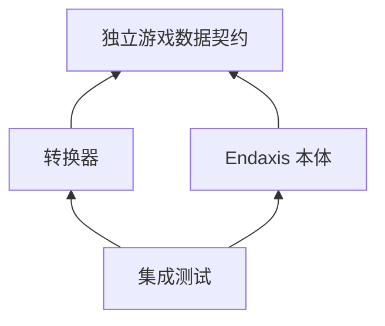
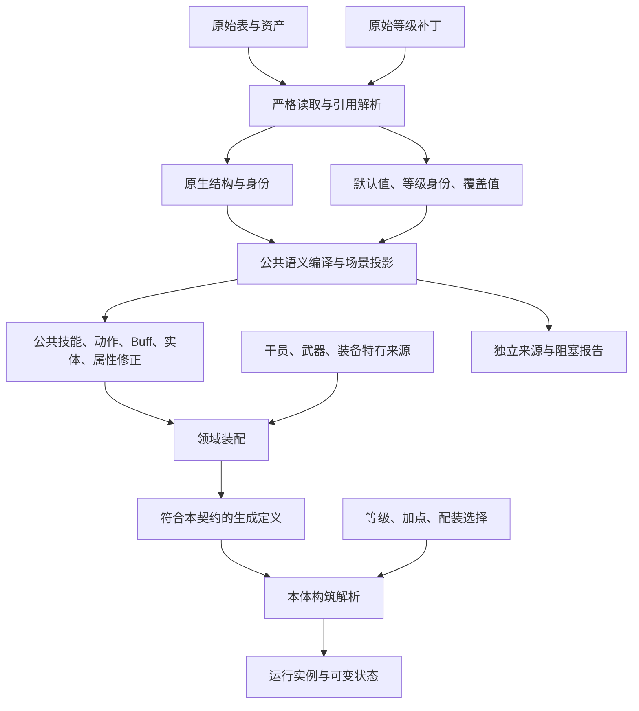

# 游戏数据契约

本包是转换器与 Endaxis 交换生成数据时的唯一类型来源，不是原生游戏 schema，也不是模拟运行时。
首次迁移只调整既有契约的定义位置和依赖方向。后续静态属性编译已直接使用本包的 `LevelValues`，
不改变序列化字段或游戏取值语义；单值与等级列不再需要两套修正结构。

公共投影输出允许取契约的窄子集，但不得另造一套近似协议。字段以 Pick/Extract 等方式派生，
输出枚举不能放宽为 string/number；来源层的未知值由投影显式阻断。编译器的
`compiledCombatContract.test.ts` 随完整类型检查验证公共 Buff/动作及武器输出的可赋值关系，
不能用 as/unknown 绕过差异。类型门禁与外部 JSON 的运行时校验是不同职责，后者仍需单独执行。

转换器的公共输出子集集中于 `combatActionProjectionTypes.ts` 与 `buffProjectionTypes.ts`：
前者只依赖契约，后者只依赖契约及前者；它们不包含转换算法、原生来源类型或领域特例。
原实现模块只兼容转导出。唯一声明和依赖方向由编译器边界测试检查；窄枚举和必需字段仍须保留，
不能因契约支持更多形状而自动放开转换能力。

## 依赖与转换是两种关系

契约不得引用本体、转换器、浏览器、文件系统或任何第三方实现；类型导入也不能例外。
转换器的生产代码不得导入本体。本体生产代码不得导入转换器。集成测试可以同时使用两端。
现有 `src/shared/gameplayTags.ts`、`weaponAssetIdentity.ts` 是双方已复用的独立工具，不属于本体运行时；
暂不搬动。门禁会检查转换器的传递依赖，防止这些工具再引回本体。工具中的可变 Tag 索引不进入数据契约。

第二张图是约定的数据边界，不表示当前实现已经消除了所有展开、聚合或中间类型。

## 唯一归属

| 文件            | 负责的纯数据                                  |
| --------------- | --------------------------------------------- |
| `primitives.ts` | 基础身份、元素、等级值和通用枚举              |
| `conditions.ts` | 条件树、动作数值引用、比较与数值操作          |
| `actions.ts`    | 步骤参数、序列、调度与公共战斗事件            |
| `skills.ts`     | 技能、技能组、连携注册、实体及实体子技能      |
| `operators.ts`  | 干员定义、成长、天赋、潜能及领域装配          |
| `buffs.ts`      | Buff 纯数据属性、生命周期序列和外部 Buff 文档 |
| `modifiers.ts`  | 属性槽位以及伤害、治疗、失衡修正的数据定义    |
| `equipment.ts`  | 武器、装备、套装和词条的领域装配              |

原生 `SkillData`、`AttributeModifierData` 等仍归转换器来源模型：原生类型身份不同的结构不能因字段相似合并。
原生事实以 combat-spec 为依据；本契约只描述 Endaxis 支持的语义，类型可表示不等于已有原生转换证据。
模拟运行类、战斗可变集合、运行时回调端口和实例快照只属于本体。不得从这些类型 `Omit`/`Pick` 派生生成定义。
Buff 的公共可序列化属性应独立定义，技能 Buff 和外部 Buff 文档共同组合它；不能从执行器反向裁剪。
本体原有路径只保留兼容性转导出，不再声明副本；各模块分工以概念归属为准，不按使用者复制定义。

## 类型归属与中间表示

新增类型默认复用已有唯一声明；不能因为经过不同函数、不同阶段或不同领域，就复制一套同形定义。
这里的“基础定义”是按语义分模块的独立契约，不是把所有类型集中到 `primitives.ts`。

| 类别 | 归属与准入条件 |
| --- | --- |
| 原生来源模型 | 转换器来源层，以 combat-spec 证据确定身份；不能用已简化的正式类型覆盖原生值域 |
| 正式输出及其阶段子集 | 本契约唯一声明；阶段输出用 `Pick` / `Extract` / 必要收窄派生，不另造 schema |
| 编译中间表示 | 转换器内部；必须说明生产者、消费者、额外信息、阶段不变量及退出阶段 |
| 编译工具类型 | 请求、诊断、缓存、回调和上下文留在实现所属模块，不属于游戏数据契约 |

“类型名称有 Compiled/Projected”不构成中间表示存在的理由。武器静态候选与已装配运行定义是
正式输出的阶段子集；保留原生请求、未解析黑板值和资源依赖的安装计划才有独立的编译期意义。
当前武器星级、武器类型、Ability 事件及装备槽位已直接复用契约；旧类型名只作兼容转导出。
干员角色/星级、头部/成长/信赖、套装及公共调度输出也已按此规则收敛；信赖仍限定具体四维，
调度结束帧仍必填。实体蓝图和子技能直接返回契约，不能通过断言掩盖差异。
原生关键帧查询、未解析安装计划与带等级身份的黑板仍属编译期数据，不并入正式定义。
技能组计划的分类/等级来源也从契约派生，在配置入口校验；原生组整数和技能键链接仍保留。
元素归一输出复用 DamageElement，但原生枚举、别名和旧公开顺序不变。伤害类型的已支持子集
应从伤害协议派生，不能因与角色元素恰有相同值集合而改换概念归属。
养成中间态的 overwrite、原生 skillId 和字符串值不属于正式修正协议；由投影显式转换或阻断。

优化应优先使用现有公共结构化来源与输出树，不预建一套领域各异的 IR，也不提前引入 SSA。
确需扩展时，只添加正式输出无法承载的控制流、作用域或证据信息，枚举和值身份仍复用其真实
所属层。来源、读写/副作用、可达性等分析适合按节点 ID 独立保存，并绑定本轮 IR 版本；
变换后重新计算或明确失效，不能沿用旧分析。相同分支也不能掩盖条件求值的黑板写入。
跨 Buff/子技能/实体的未知读取、动态引用或副作用必须保守处理。

这条规则不是启用激进优化：黑板活性删除、条件值表达式和跨边界常量传播仍须单独建立证据、
读写分析与差分回归，不能在类型整理中顺手实施。

## 数值与引用约定

- `LevelValues = number | readonly number[]`：单值与等级无关；数组在具体定义的等级轴上按 1 基等级取下标。
  它本身不标识等级轴：技能、武器词条、装备精锻与养成节点分别由所属定义和构筑选择确定。
- 原生补丁的等级 ID、默认值、缺档和输入覆盖顺序由转换器保留；不得把任意补丁行号当正式等级。
  本轮不调整既有本体对等级边界的处理，也不把此前提出的连续等级限制偷偷加入转换流程。
- `ActionValueOperand` 和 Buff 的 `{ blackboardKey }` 是运行时引用，不等同于 `LevelValues`。
  引用在对应技能、事件或 Buff 实例作用域中求值，不能在生成时按某一技能等级冻结。
- 蓝图与安装引用分离：Buff ID 和定义不因为多个词条使用而变成多个定义；每次施加的覆盖值属于施加行为。
  具体私有、公共资源的注册与归属仍由领域装配负责，本轮不改变现有武器 Buff 的挂载位置。

## 演进与门禁

1. 每个概念只在上述一个模块声明；重新导出不是重新定义。新增字段必须同时说明语义、单位、缺省和引用作用域。
2. 声明只能包含可序列化数据、枚举和值类型；不能引入执行回调或运行类。
3. 独立 TypeScript 检查不加载本体、转换器或浏览器类型；依赖门禁同时检查静态导入、转导出和类型导入。
4. 契约迁移沿用现有文档版本。静态常量现在可保持单值，不再制造重复数组，两者都属于已有协议。
   未来不兼容变更须有明确版本和存档迁移方案。
5. 既有完整结构校验暂留在本体，生成与消费的一致性由集成测试验证；不得在转换器复制第二个近似校验器。
   后续纯校验迁入本包前，必须先拆掉校验与 Buff 执行器的耦合，不能整段搬入运行依赖。
6. 等级链路保留一份结构与参数列。静态属性已整列投影，正式修正类型由契约约束，投影只额外包含
   装备顶层 `baseDefense`。武器运行安装已使用一份结构＋参数列，条件只选择安装引用；默认黑板值
   已保持单值，不再按等级复制，原生补丁列保持原引用。`ScalarSource` 的已知默认值不能消除其
   运行引用键。真实结构差异仍需显式处理；公共动作/Buff 输出子集已改为契约派生，
   但这不表示其他编译模块及运行时 validator 也全部完成迁移。

本包现阶段是仓库内的独立契约模块；没有发布到 npm，也不依赖 npm 安装或路径别名才能运行。
